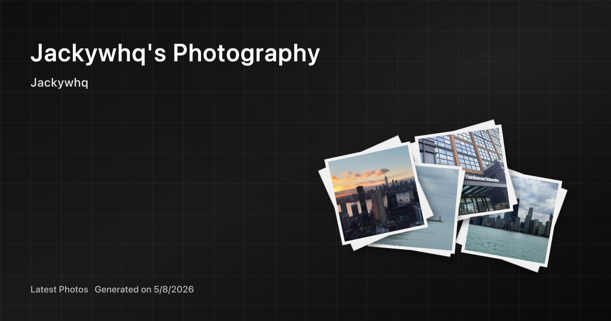

# <p align="center">Jacky's Photography</p>



> [!IMPORTANT]
> 本项目由 [Jackyhq](https://github.com/Jackyhq) 基于原仓库 [Afilmory/afilmory](https://github.com/Afilmory/afilmory) 进行深度定制与二次开发。
> 在保留原项目核心优势的基础上，本项目包含了由 Jackyhq 独立开发的自动化部署、构建优化、照片标准化和交互体验增强。
>
> **版权声明：**
> 仓库中 `photos/` 目录下的所有照片，以及由这些照片生成的缩略图、OG 图、README 预览图等媒体文件，均为 **Jackyhq 个人拍摄作品或其衍生媒体**。这些资产**不属于开源范围**，未经明确书面许可，严禁以任何形式（包括但不限于商业用途、二次分发、个人展示、公开展示等）进行转载、引用或使用。

Afilmory (/əˈfɪlməri/) 是一个专为个人摄影网站创造的词汇，融合了自动对焦（AF）、光圈（Aperture，光影控制）、胶片（Film，复古媒介）和记忆（Memory，定格瞬间）。

这是一个基于 React、TypeScript、Vite 和 pnpm workspaces 构建的个人摄影画廊。项目以纯客户端 SPA 的形式发布，照片元数据由 `@afilmory/builder` 在构建前生成，前端通过静态 `photos-manifest.json` 提供瀑布流浏览、全屏查看、EXIF 展示、地图探索、Live Photo、HDR、双语描述和照片级 SEO 等体验。

演示画廊：

- **[photo.jackyw.cn](https://photo.jackyw.cn)**

## 特性

### 画廊体验

- **高性能图片查看器**：`@afilmory/webgl-viewer` 提供流畅的缩放和平移体验，移动端可回退到 DOM 查看器。
- **响应式瀑布流布局**：基于 Masonic，适配桌面和移动端。
- **全屏照片详情**：支持 EXIF、直方图、胶片模拟信息、Live Photo、HDR 标识和缩略图导航。
- **命令面板与筛选**：支持按标题、双语描述、标签、相机和镜头信息检索照片，并支持标签并集/交集筛选。
- **地图探索**：使用 MapLibre 展示带 GPS 信息的照片位置，并支持聚合与缩略图预览。
- **国际化**：基于 i18next，支持多语言文案。
- **本地化可访问性与分享信息**：照片 alt 文本、详情页描述和页面 meta 会按当前语言选择人工描述，并回退到标题或照片 ID。
- **照片级静态 meta 页面**：生产构建会为 `/photos/:id` 生成带独立标题、描述、canonical、OpenGraph 和 Twitter Card 的 HTML。
- **个人主页社交链接**：首页资料卡支持 GitHub、Instagram、Twitter、RSS 和作者主页链接。
- **移动端首屏优化**：首页缩略图使用响应式 WebP 资源，关键首屏图片会在 HTML 阶段预加载，详情页、命令面板和特殊格式转换逻辑按需加载。

### 构建与处理

- **增量构建**：根据现有 manifest、文件大小和修改时间判断是否需要重新处理。
- **多存储适配**：支持 `local`、`s3`、`github` 和 `eagle` 存储提供商。
- **格式处理**：支持 JPEG、PNG、HEIC/HEIF、TIFF、BMP 等常见照片格式的读取与转换。
- **缩略图与占位图**：生成 `360w`/`640w` WebP 缩略图、`640w` JPEG fallback、Thumbhash 和色调分析数据。
- **照片标准化**：`photos/incoming` 中的照片可按 EXIF 时间自动重命名并移动到分类目录。
- **人工照片描述合并**：`photo-descriptions.json` 可维护标题、`zh-CN`/`en` 描述和人工标签，构建时由 builder 插件合并进 manifest。
- **轻量首屏 manifest**：构建时将首页所需的轻量 manifest 注入 HTML，并额外输出完整 manifest JSON，详情视图和 manifest 页面按需加载完整数据。
- **并发处理**：支持 worker/cluster 模式，适合批量照片处理。

## 技术栈

- **前端**：React 19、React Router 7、TypeScript、Vite、Tailwind CSS 4、Radix UI、Jotai、TanStack Query、Motion。
- **图像处理**：Sharp、exiftool-vendored、heic-to/heic-convert、Blurhash、Thumbhash。
- **地图**：MapLibre GL、react-map-gl、MapLibre Geocoder。
- **工程化**：pnpm workspace、ESLint、Prettier、simple-git-hooks、lint-staged。
- **文档站**：`packages/docs` 使用 Vite、React 和 MDX 生成静态文档。

## 项目结构

```plain
apps/web/                 # 主摄影画廊 SPA
packages/builder/         # 照片处理、缩略图、EXIF 和 manifest 生成工具
packages/data/            # manifest 数据访问层和 photoLoader
packages/docs/            # MDX 文档站点
packages/hooks/           # 共享 React hooks
packages/sdk/             # 轻量 SDK/schema
packages/ui/              # 共享 UI 组件和设计系统基础件
packages/utils/           # 通用工具、RSS、动画和数据处理工具
packages/webgl-viewer/    # WebGL 图片查看器
photos/                   # 个人照片源文件，不属于开源范围
```

## 快速开始

### 环境要求

- Node.js 24（CI 使用 Node 24）
- pnpm 10.19.0
- Perl（`exiftool-vendored` 运行时需要）

### 本地开发

```bash
# 安装依赖
pnpm install

# 可选：标准化 photos/incoming 中的新照片
pnpm run photos:standardize

# 生成或更新照片 manifest
pnpm run build:manifest

# 启动画廊开发服务器
pnpm dev
```

`pnpm dev` 会先执行 web precheck，并在 Vite 启动前调用 builder CLI 生成或更新 manifest。

### 生产构建

```bash
# 构建生产版 SPA
pnpm build

# 构建文档站
pnpm docs:build
```

构建产物位于 `apps/web/dist/`。GitHub Actions 会额外把该目录同步到根目录 `web/`，用于提交和保存当前静态输出。

## 常用命令

```bash
# Web 开发
pnpm dev

# Web 生产构建
pnpm build

# 文档站开发/构建/预览
pnpm docs:dev
pnpm docs:build
pnpm docs:preview

# 构建照片 manifest
pnpm run build:manifest
pnpm run build:manifest -- --force
pnpm run build:manifest -- --force-thumbnails
pnpm run build:manifest -- --force-manifest
pnpm run build:manifest -- --config

# 照片入库标准化
pnpm run photos:standardize

# 根据当前 manifest 同步人工照片描述 sidecar
pnpm run photos:descriptions:sync
pnpm run photos:descriptions:sync -- --prune

# 质量检查
pnpm lint
pnpm format
pnpm --filter web type-check
```

## 配置

### 站点配置

站点品牌、作者、社交链接和地图配置由 `config.json` 与 `site.config.ts` 控制：

```json
{
  "name": "Jacky's Photography",
  "title": "Jackywhq's Photography",
  "url": "https://photo.jackyw.cn",
  "accentColor": "#007bff",
  "social": {
    "github": "Jackyhq",
    "instagram": "https://www.instagram.com/jackywhq/",
    "twitter": "",
    "rss": false
  },
  "map": ["maplibre"],
  "mapStyle": "builtin",
  "mapProjection": "mercator"
}
```

前端会在构建时读取默认配置，也支持运行时注入 `window.__SITE_CONFIG__` 覆盖部分字段。

### 照片构建配置

照片处理由 `builder.config.ts` 控制。当前项目使用本地照片目录作为源：

```ts
import { defineBuilderConfig } from '@afilmory/builder'

export default defineBuilderConfig(() => ({
  storage: {
    provider: 'local',
    basePath: './photos',
    baseUrl: 'https://photos3.jackyw.cn/photos/',
    excludeRegex: '^incoming($|/.*)',
  },
  plugins: [new URL('plugins/builder/photo-descriptions.ts', import.meta.url).href],
}))
```

`storage.provider` 可选值：

- `local`：读取本地目录，适合本仓库的照片源、开发和自托管。
- `s3`：读取 S3 兼容存储，适合生产级对象存储与 CDN。
- `github`：读取 GitHub 仓库内容，适合小型图库或静态资源仓库。
- `eagle`：读取 Eagle 4 资料库，可按标签或文件夹筛选并导出照片。

常见系统参数位于 `system.processing` 和 `system.observability`，可配置默认并发数、Live Photo 检测、摘要后缀、日志级别、worker 数、cluster 模式和 worker 超时。

## 照片工作流

1. 将新照片放入 `photos/incoming/`，或直接放入 `photos/<分类>/`。
2. 运行 `pnpm run photos:standardize`。脚本会读取 EXIF 时间，将文件重命名为 `YYYYMMDDHHmmss.ext`，并移动到目标分类目录；直接放在 `incoming` 根目录的文件会进入 `photos/随手/`。
3. 运行 `pnpm run build:manifest`。构建器会扫描照片、提取 EXIF、生成缩略图，并把 `photo-descriptions.json` 中匹配到的人工标题、双语描述和标签合并进 manifest。
4. 需要补充新照片描述时，运行 `pnpm run photos:descriptions:sync` 根据当前 manifest 同步 `photo-descriptions.json`，填写 `title`、`descriptions.zh-CN`、`descriptions.en` 和精简标签后再次运行 `pnpm run build:manifest`。
5. 运行 `pnpm dev` 预览，或运行 `pnpm build` 生成静态站点。

`photo-descriptions.json` 使用照片存储路径作为 `key`。同步脚本会保留未匹配的旧条目；如需移除已经不在 manifest 中的旧照片条目，可运行：

```bash
pnpm run photos:descriptions:sync -- --prune
```

当缩略图策略或 manifest 结构变更时，使用完整重建命令确保生成物与前端代码一致：

```bash
pnpm run build:manifest -- --force-thumbnails --force-manifest
pnpm --filter web type-check
pnpm build
```

## 自动部署

`.github/workflows/deploy.yml` 在推送到 `main` 且相关路径变更时部署，也支持手动触发。Pull Request 会运行同一套标准化、manifest 和 web 构建校验，但不会发布 GitHub Pages 或提交构建产物。

触发路径包括 `.github/workflows/deploy.yml`、`photos/**`、`apps/**`、`packages/**`、`package.json`、`pnpm-lock.yaml`、`config.json`、`builder.config.ts` 和 `site.config.ts`。部署流程包括：

1. 安装 pnpm 与 Node.js 24。
2. 执行 `pnpm install`。
3. 执行 `pnpm run photos:standardize`。
4. 执行 `pnpm run build:manifest`。
5. 执行 `pnpm run build`。
6. 校验 `apps/web/dist/`，复制 sitemap 为 `googlesitemap.xml`。
7. 将构建产物同步到根目录 `web/` 并提交 `photos/**` 和 `web/**`。
8. 上传 `apps/web/dist/` 到 GitHub Pages 并部署。

PR 校验会按 PR 编号设置并发分组并取消过期运行；部署任务使用 Pages 权限，只在非 PR 事件中执行。

## 文档

- 文档站源码位于 `packages/docs/contents/`。
- 新建文档可运行 `pnpm create:doc`。
- 文档站开发命令为 `pnpm docs:dev`，生产构建为 `pnpm docs:build`。
- 照片描述、人工标签和照片级 SEO 工作流记录在 `packages/docs/contents/photo-metadata/index.mdx`。
- 移动端性能、响应式缩略图和分包策略记录在 `packages/docs/contents/performance/index.mdx`。

## 许可证

本项目代码遵循 [Attribution Network License (ANL) v1.0](LICENSE)。

`photos/**`、`web/thumbnails/**`、`apps/web/public/thumbnails/**`、`web/og-image-*.png`、`apps/web/public/og-image-*.png`、`web/readme-og-image.png` 以及其他由个人照片生成的媒体资产不属于开源授权范围，详见 [LICENSE](LICENSE) 的 Documentation & Media 排除条款。

Copyright (c) 2025-2026 Jackyhq. All rights reserved.
